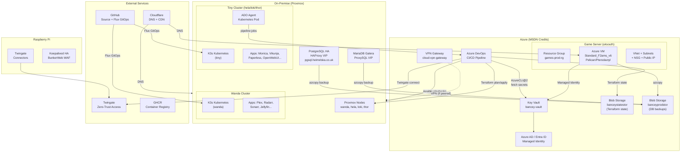

# Target Architecture and Migration Strategy

> Part of the Azure Exit Plan for bancey/lab-ops

---

## Current Architecture



### Key characteristics of current architecture

- **Azure is the control plane**: All secrets, CI/CD, and state flow through Azure.
- **Proxmox is the compute plane**: VMs, Kubernetes clusters, and databases run on-prem.
- **Cloudflare and Twingate are already vendor-neutral**: These stay.
- **Game server is the only Azure compute workload**: All other compute is on Proxmox.
- **SOPS + Age already encrypts Kubernetes secrets**: The tooling for secrets independence already exists.

---

## Target Architecture

```mermaid
graph TB
    subgraph GH["GitHub"]
        GHACTIONS["GitHub Actions\nCI/CD Pipeline"]
        GHSECRETS["GitHub Encrypted\nSecrets"]
        GHCR2["GHCR\nContainer Registry"]
        FLUX["Flux GitOps\nSource"]
    end

    subgraph Hetzner["Hetzner Cloud"]
        subgraph HGame["Game Server"]
            HVM["Hetzner VM\nCX32 / CCX23\nPelican/Pterodactyl"]
            HNET["Hetzner Network\n+ Firewall"]
        end
    end

    subgraph StateStore["State Storage"]
        R2["Cloudflare R2\nTerraform State\n(S3-compatible)"]
    end

    subgraph BackupStore["Backup Storage"]
        R2B["Cloudflare R2\nor Backblaze B2\nDB Backups\n(rclone)"]
    end

    subgraph OnPrem["On-Premise (Proxmox)"]
        subgraph Tiny["Tiny Cluster (hela/loki/thor)"]
            K8S_TINY["K3s Kubernetes\n(tiny)"]
            ARC["Actions Runner\nController (ARC)\nSelf-Hosted Runners"]
            APPS_TINY["Apps: Monica, Vikunja,\nPaperless, OpenWebUI..."]
        end
        subgraph Wanda["Wanda Cluster"]
            K8S_WANDA["K3s Kubernetes\n(wanda)"]
            APPS_WANDA["Apps: Plex, Radarr,\nSonarr, Jellyfin..."]
        end
        PGSQL["PostgreSQL HA\npgsql.heimelska.co.uk"]
        MARIADB["MariaDB Galera"]
        PROXMOX["Proxmox Nodes\nwanda, hela, loki, thor"]
    end

    subgraph RPi["Raspberry Pi"]
        TWINGATE_CONN["Twingate\nConnectors"]
        HA_RPi["Keepalived HA\nBunkerWeb WAF"]
    end

    subgraph External["External Services (retained)"]
        CF["Cloudflare\nDNS + CDN"]
        TWINGATE["Twingate\nZero-Trust Access"]
    end

    GHACTIONS -->|"secrets from\nGH Encrypted Secrets"| GHSECRETS
    GHACTIONS -->|"Terraform state"| R2
    GHACTIONS -->|"Twingate connect"| TWINGATE
    GHACTIONS -->|"Terraform apply\n(via Twingate)"| PROXMOX
    GHACTIONS -->|"Ansible\n(via Twingate)"| OnPrem
    GHACTIONS -->|"Terraform apply"| HVM
    ARC -->|"self-hosted\nrunner"| GHACTIONS
    PGSQL -->|"rclone backup"| R2B
    MARIADB -->|"rclone backup"| R2B
    TWINGATE_CONN --> TWINGATE
    FLUX -->|"GitOps sync"| K8S_TINY
    FLUX -->|"GitOps sync"| K8S_WANDA
    CF -->|"DNS"| OnPrem
    CF -->|"DNS"| HVM
    HVM -->|"Twingate"| TWINGATE
```



### Key characteristics of target architecture

- **GitHub is the new control plane**: Secrets, CI/CD, and state management all move to GitHub.
- **Azure is fully eliminated**: No Azure resources, no service connections, no MSDN credits needed.
- **On-premise Proxmox is unchanged**: All on-prem compute remains as-is.
- **Hetzner Cloud for game server**: Azure VMs replaced with Hetzner at a fraction of the cost.
- **Cloudflare R2 for state and backups**: S3-compatible, minimal cost, no egress fees.
- **rclone replaces azcopy**: Provider-agnostic tool for object storage operations.
- **ARC replaces ADO agents**: Self-hosted GitHub Actions runners on existing Kubernetes cluster.

---

## Migration Strategy by Stream

### Stream 1: Secrets / Config

**Goal:** Eliminate Azure Key Vault dependency. All secrets move to GitHub Encrypted Secrets.

**Steps:**
1. Audit all secrets in `bancey-vault` (see `azure-inventory.md` for full list).
2. Add each secret to GitHub repository/environment secrets.
3. Update Terraform to accept secrets via `TF_VAR_*` environment variables instead of `data "azurerm_key_vault_secret"` blocks.
4. Update Ansible pipeline steps to pass secrets as `--extra-vars` from GitHub Actions secrets.
5. Remove `data "azurerm_key_vault"` and `data "azurerm_key_vault_secret"` blocks from all `*.tf` files.
6. Remove `AzureCLI@2` tasks that fetch secrets from Key Vault.
7. Keep SOPS + Age for Kubernetes secrets (already working; no change needed).

**Files to change:**
- All `terraform/components/*/interpolated-defaults.tf`
- `terraform/components/twingate/connector.tf`, `service_account.tf`
- `infra-pipeline.yaml` (replaced by GitHub Actions workflows)

**Rollback:** GitHub Actions secrets can be added/removed without code changes. Old Key Vault secrets remain until explicitly decommissioned.

---

### Stream 2: Terraform State

**Goal:** Move Terraform remote state from Azure Blob Storage to Cloudflare R2.

**Steps:**
1. Create Cloudflare R2 bucket (e.g., `lab-ops-tfstate`).
2. Generate R2 API credentials (access key + secret key).
3. For each Terraform component:
   a. Run `terraform state pull > backup.tfstate` against existing Azure backend.
   b. Update `init.tf` to use `backend "s3"` with R2 endpoint.
   c. Run `terraform init -migrate-state` to copy state to R2.
   d. Verify `terraform plan` shows no changes.
4. Remove Azure backend configuration.
5. Delete old state files from `banceystatestor` (after soak period).

**Files to change:**
- `terraform/components/*/init.tf` — replace `backend "azurerm"` with `backend "s3"`
- GitHub Actions workflows — replace `backendStorageAccount` parameter with R2 credentials

**Rollback:** State files backed up in step 3a. Can re-init with Azure backend if needed.

---

### Stream 3: Database Backups

**Goal:** Replace azcopy + Azure Blob with rclone + Cloudflare R2 (or Backblaze B2).

**Steps:**
1. Create R2 bucket (e.g., `lab-ops-backups`) and generate credentials.
2. Update `ansible/postgresql.yaml`:
   - Replace `Install azcopy` task with `Install rclone`.
   - Replace `azcopy copy` command with `rclone copy` targeting R2.
   - Replace `backup_sas_token` variable with `r2_access_key` + `r2_secret_key`.
3. Update `ansible/mariadb.yaml` with same changes.
4. Update `prod.tfvars` Ansible secrets block to reference R2 credentials instead of SAS token.
5. Add R2 credentials to GitHub Actions secrets.
6. Run backup cycle and verify files appear in R2.
7. Decommission `banceyprodstor` storage account.

**Files to change:**
- `ansible/postgresql.yaml` — swap azcopy for rclone
- `ansible/mariadb.yaml` — swap azcopy for rclone
- `terraform/environments/prod/prod.tfvars` — update secret names

**Rollback:** Keep azcopy tasks commented out during transition. R2 and Azure Blob can run in parallel.

---

### Stream 4: Game Server (Azure VMs → Hetzner)

**Goal:** Move Pelican/Pterodactyl game server from Azure VMs to Hetzner Cloud.

**Steps:**
1. Create new Terraform component `terraform/components/game-server-hetzner/` using `hcloud` provider.
2. Provision Hetzner VM with equivalent spec to `Standard_F2ams_v6`.
3. Install Pelican via existing provisioner (adapt `setup-twingate.sh` for Hetzner, using `cloud-init` or `remote-exec`).
4. Configure Twingate connector on Hetzner VM.
5. Update Cloudflare DNS to point game server hostname to Hetzner IP (via Terraform).
6. Test game server functionality on Hetzner.
7. Decommission Azure game server (`terraform destroy` on `game-server` component).
8. Remove Azure networking resources.

**Files to change:**
- New: `terraform/components/game-server-hetzner/`
- Remove: `terraform/components/game-server/` (after migration)
- Update: `terraform/environments/prod/prod.tfvars`
- Update: `infra-pipeline.yaml` / GitHub Actions workflow

**Rollback:** Keep Azure game server running until Hetzner is validated. DNS switch is instant to revert via Cloudflare.

---

### Stream 5: CI/CD (Azure DevOps → GitHub Actions)

**Goal:** Replace `infra-pipeline.yaml` (ADO) with GitHub Actions workflows.

**Steps:**
1. Create `.github/workflows/terraform.yaml` replicating Terraform stages.
2. Create `.github/workflows/ansible.yaml` replicating Ansible stages.
3. Add Twingate connect step using `twingate/github-action-setup-twingate` (or equivalent).
4. Replace `AzureCLI@2` steps with direct use of GitHub Actions secrets.
5. Configure GitHub repository environments (`prod`, `test`) with protection rules.
6. Deploy `actions-runner-controller` (ARC) to `tiny` cluster to replace ADO agent.
7. Test full pipeline run on a branch.
8. Disable Azure DevOps pipeline.
9. Remove Azure DevOps agent deployment (`kubernetes/apps/base/azdevops/`, `ansible/ado-agent.yaml`).

**Files to change:**
- New: `.github/workflows/terraform.yaml`
- New: `.github/workflows/ansible.yaml`
- `infra-pipeline.yaml` — decommission
- `kubernetes/apps/base/azdevops/` — replace with ARC
- `kubernetes/apps/tiny/azdevops-secret.sops.yaml` — decommission

**Rollback:** Keep ADO pipeline active until GH Actions pipeline is validated end-to-end.

---

### Stream 6: Azure VPN Gateway

**Goal:** Decommission the `cloud-vpn-gateway` Terraform component.

**Steps:**
1. Verify all connectivity is handled by Twingate (audit network routes).
2. Confirm no services depend on the VPN gateway for routing.
3. Run `terraform destroy` on `cloud-vpn-gateway` component (test, then prod).
4. Remove component from `infra-pipeline.yaml` / GitHub Actions workflow.
5. Archive or delete `terraform/components/cloud-vpn-gateway/`.

**Rollback:** Re-apply Terraform if needed (state files retained in R2 until final cleanup).

---

### Stream 7: Azure AD / Identity

**Goal:** Remove all Azure AD / Entra ID dependencies.

This stream is completed automatically when:
- Azure VMs (game server) are migrated to Hetzner (eliminates managed identity).
- Azure Key Vault is replaced (eliminates role assignments on KV).
- Azure DevOps service connection is retired.

No explicit action required beyond ensuring all VM SSH access uses key-based authentication (already the pattern for Proxmox VMs).

---

## Migration Timeline (Suggested)

```
Week 1–2:   Stream 1 (Secrets) + Stream 2 (Terraform State)
Week 3:     Stream 3 (DB Backups)
Week 4–5:   Stream 5 (CI/CD — GitHub Actions)
Week 6:     Stream 4 (Game Server — Hetzner)
Week 7:     Stream 6 (VPN Gateway decommission)
Week 8:     Stream 7 (AAD cleanup) + Final validation + Cost review
```

Streams 1 and 2 are prerequisites for Streams 4 and 5 (CI/CD needs new secrets mechanism before Azure is removed).

---

## Non-Functional Requirements

| Requirement | How addressed |
|---|---|
| Prefer open standards | SOPS + Age (open), rclone (open), GitHub Actions (open), Hetzner API (standard REST) |
| Avoid vendor lock-in in application code | No application code changes; only IaC and CI/CD changes |
| Everything automatable via IaC + CI | Hetzner provisioned via Terraform; runners via Kubernetes/Flux; secrets via GH |
| Keep downtime minimal | All transitions maintain parallel run before cutover |
| Safe rollback | Each stream has explicit rollback steps |

---

## Definition of Done

- [ ] No production dependency on Azure for runtime, data, secrets, CI/CD, or observability.
- [ ] All migrations documented with runbooks.
- [ ] Infra reproducible from IaC (`terraform apply` from scratch works).
- [ ] Cost baseline produced (before vs after — see `replacement-matrix.md`).
- [ ] `banceystatestor` storage account deleted.
- [ ] `banceyprodstor` storage account deleted.
- [ ] `bancey-vault` Key Vault deleted.
- [ ] `games-prod-rg` and `games-test-rg` resource groups deleted.
- [ ] Azure DevOps pipeline disabled and ADO agent deployments removed.
- [ ] Azure subscription can be safely closed.
